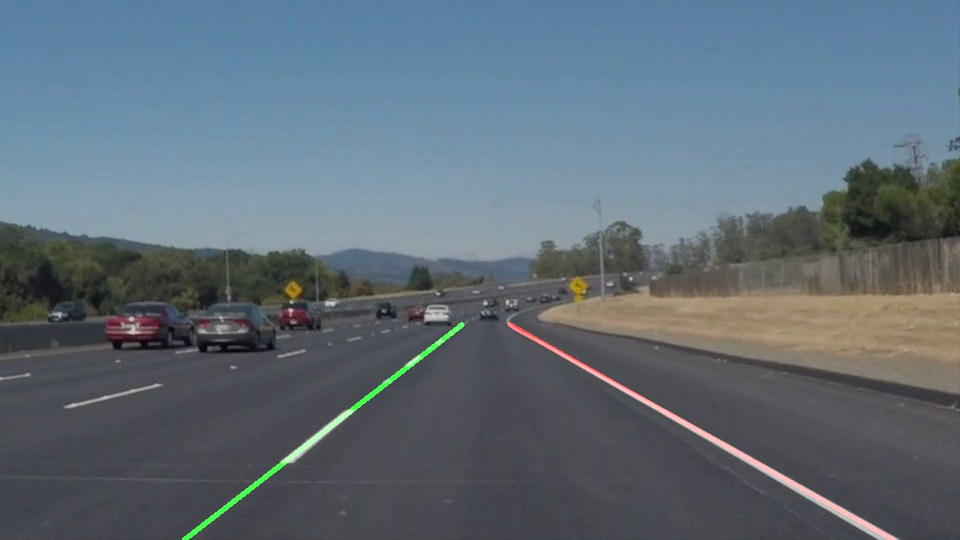
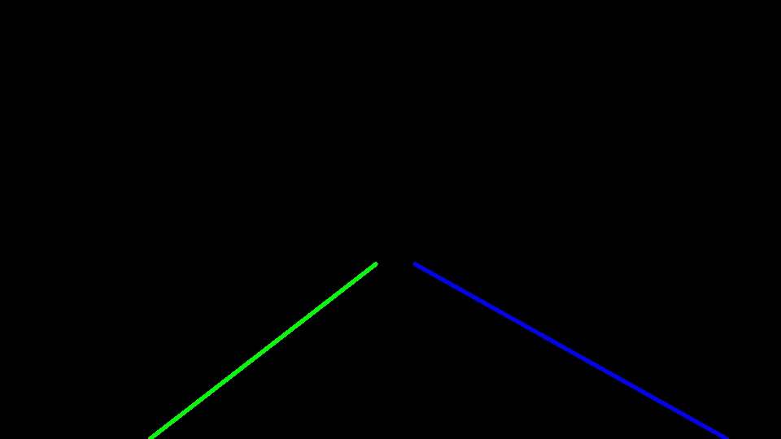

# **Finding Lane Lines on the Road** 

The goals / steps of this project are the following:
* Make a pipeline that finds lane lines on the road
* Reflect on your work in a written report

## Reflection

### 1. Pipeline Description

The image processing pipeline consists of following 5 steps

1. Grayscale conversion

2. Blur

3. Edge Detection

4. Selecting Region of Interest

5. Draw Lines

In order to draw a single line on the left and right lanes, the draw_lines() function is modified by
- Find the slope of lines
- Filter lines and choose only with 0.5 >= mod(slope) >= 10
- Saperate left and right lanes depending on slope is negative or positive respectively
- Interpolate left and right lines based on the end points of all the lines
- Extrapolate the lines by drawing them from bottom end till around 60% from bottom

## 2. Potential shortcomings with current pipeline

- In case of noise, the left and right lanes may shift from the correct location
- In case of the Car going on a lane, the region of interest may not cover the other lane marking

## 3. Possible improvements in pipeline

- Better color selection using HSV color model to avoid noise because of shadows or change in road texture
- Use perspective projection to cover curved lanes and neighbouring lanes
